# Carte des processus de données — Comptal2.1

Ce document décrit comment les données circulent dans Comptal2.1 : du démarrage à la persistance, en passant par l'import, l'édition et les agrégats.

---

## 1. Vue globale

La vue est volontairement séparée en trois schémas. Chaque schéma se lit de gauche à droite et
répond à une seule question : comment l'application démarre, comment les données entrent, puis où
elles sont consultées.

### Démarrage et stockage technique

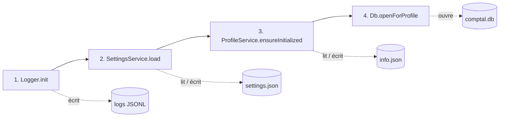

### Entrée et modification des données

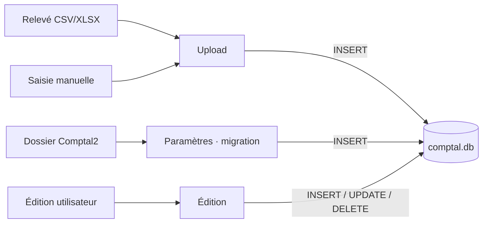

### Analyses et export CSV

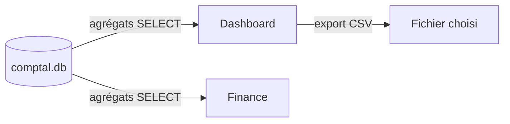

### Autres modules et archives

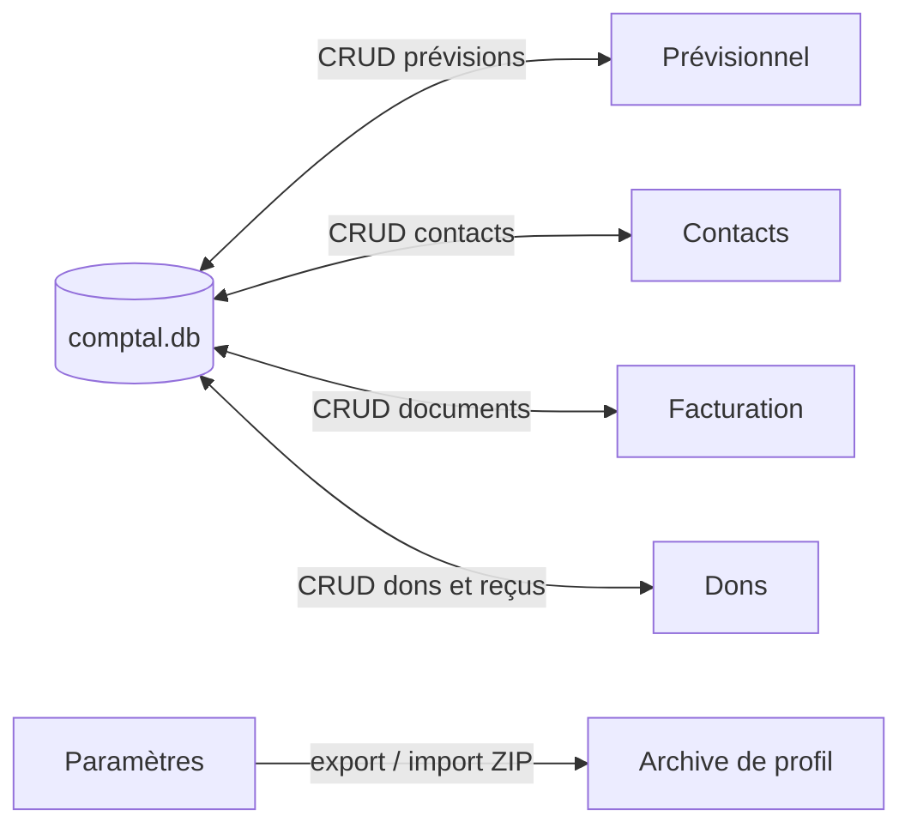

---

## 2. Processus de démarrage

| Étape | Composant | Action | Fichiers touchés |
|-------|-----------|--------|------------------|
| 1 | `Logger.init()` | Génère `sessionId`, récupère `dataRoot` via `get_session_info` | `data/logs/{sessionId}_app.jsonl` |
| 2 | `SettingsService.load()` | Lit ou crée les paramètres globaux | `data/parameter/settings.json` |
| 3 | `applyThemeToDocument()` | Applique le thème CSS | — |
| 4 | `i18n.changeLanguage()` | Charge la langue | — |
| 5 | `WindowService.apply()` | Applique dimensions fenêtre | — |
| 6 | `ProfileService.ensureInitialized()` | Charge/crée profil actif | `data/profils/{id}/info.json` |
| 7 | `Db.openForProfile(id)` | Ouvre SQLite, réparation/migrations jusqu’à v15 | `data/profils/{id}/comptal.db` |

**Changement de profil** (Paramètres → Profils) :
1. `ProfileService.setActive(newId)`
2. `SettingsService.save({ activeProfileId })`
3. `Db.close()` puis `Db.openForProfile(newId)`
4. `profileEpoch++` dans Paramètres pour remonter les onglets liés aux données

---

## 3. Modèle de données SQLite

### Relations principales

Les relations sont réparties par domaine afin d'éviter un graphe relationnel unique où les liens se
superposent.

#### Transactions

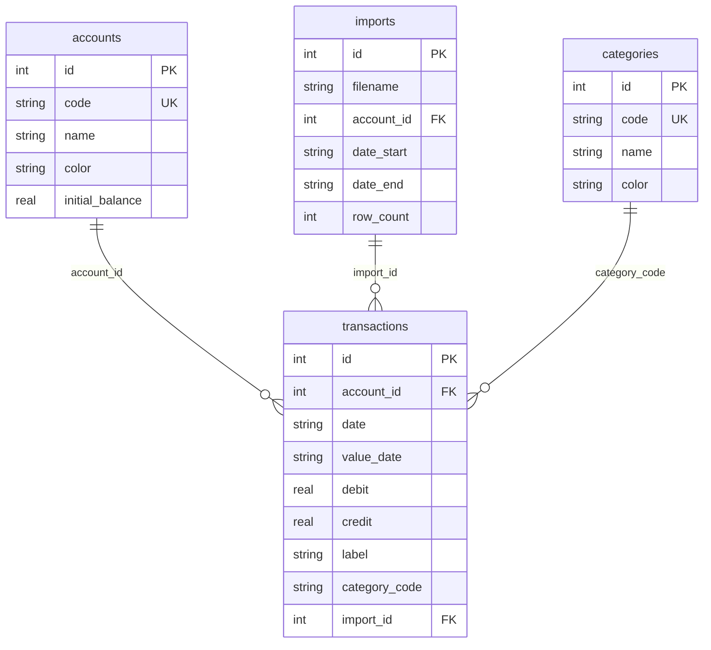

#### Imports, modèles et auto-catégorisation

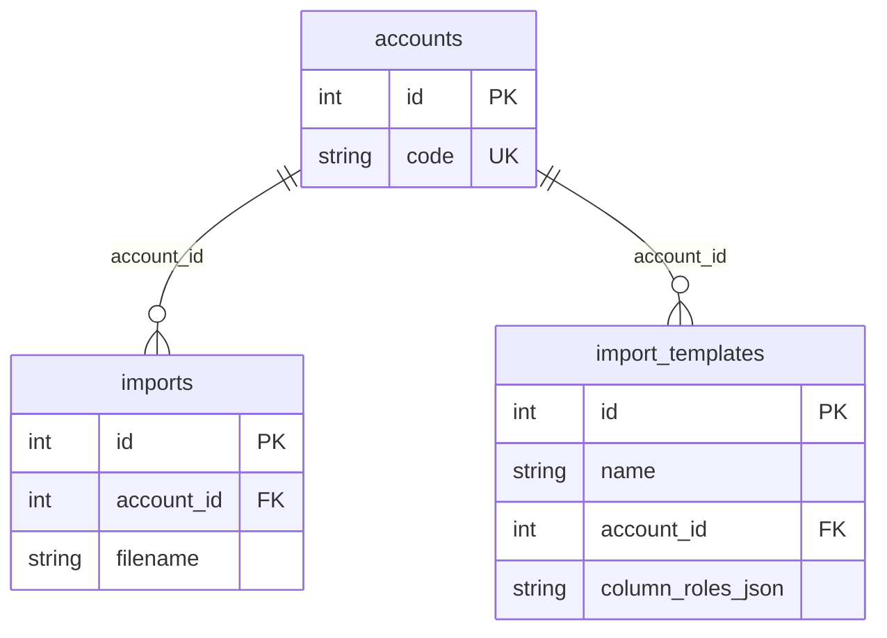

#### Prévisionnel

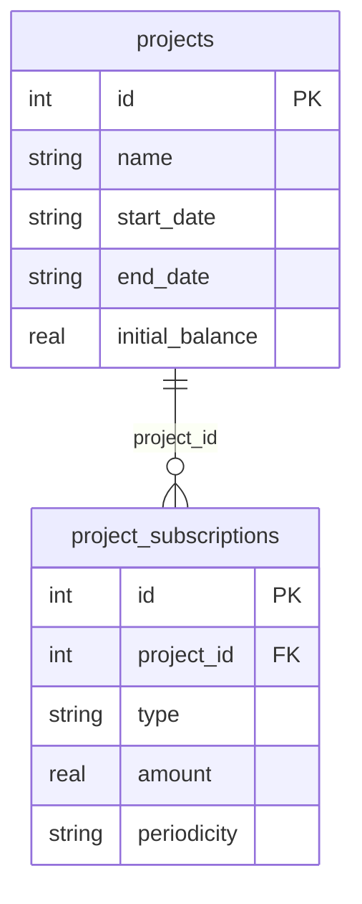

#### Relations métier sans clé étrangère SQLite

##### Contacts et facturation

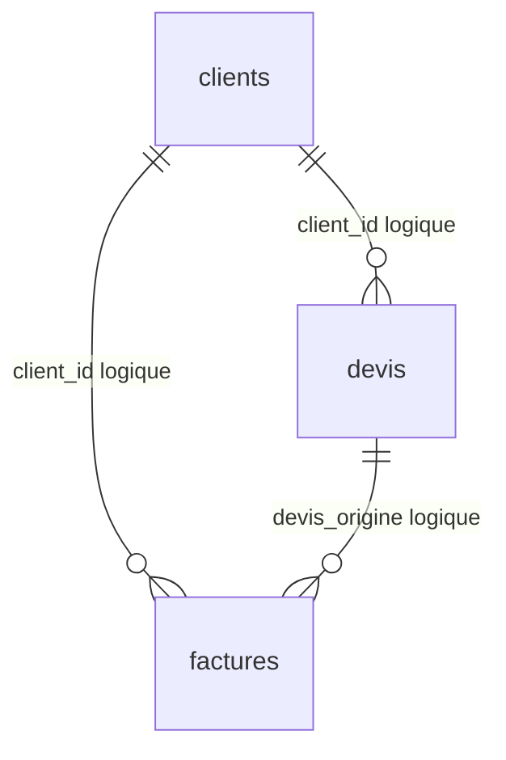

##### Dons historiques

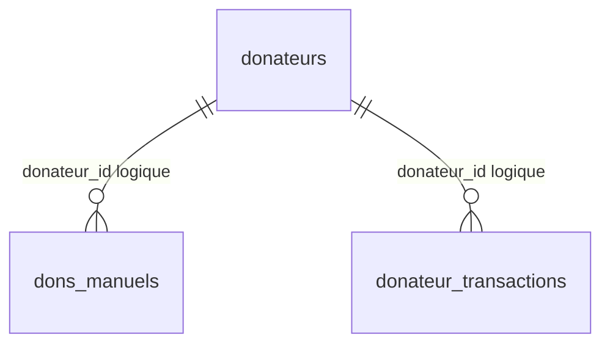

Les relations des trois premières vues sont contraintes par SQLite lorsqu’une clause `REFERENCES`
est présente, à l'exception de `categories` → `transactions`. Les deux dernières vues montrent des
identifiants métier sans contrainte FK ; les services doivent donc préserver leur cohérence.

### Tables à payload JSON

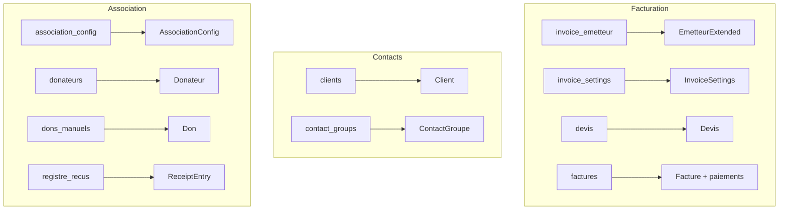

Les colonnes dédiées (`numero`, `statut`, `client_id`, `updated_at`, etc.) servent au tri et à la
recherche. Le payload est la représentation métier complète.

### Conventions de montants et dates

| Règle | Détail |
|-------|--------|
| Dates | Stockées en `TEXT` ISO `yyyy-MM-dd` |
| Débits | Valeurs ≤ 0 |
| Crédits | Valeurs ≥ 0 |
| Catégorie `X` | Exclue des KPI (`excludeCategories`) |
| Catégorie `Y` | Exclue de certains graphiques Dashboard |
| Solde compte | `initial_balance` + SUM(credit + debit) jusqu'à la date cible |

---

## 4. Processus d'import (Upload)

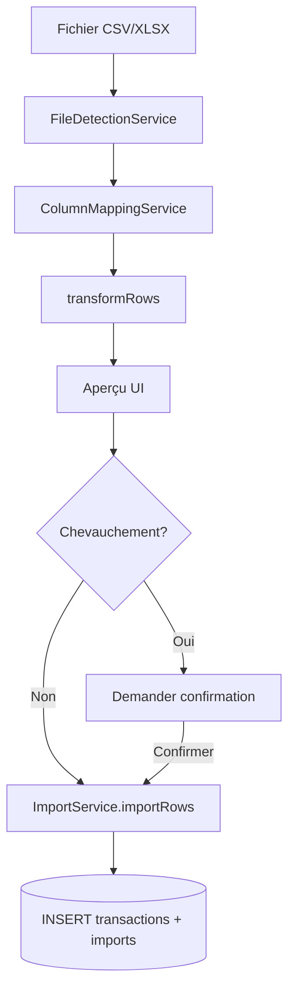

| Étape | Service | Opération SQL |
|-------|---------|---------------|
| Détection format | `FileDetectionService` | — (parse fichier en mémoire) |
| Mapping colonnes | `ColumnMappingService` | — |
| Transformation | `transformRows()` | — |
| Vérification chevauchement | `ImportService.findOverlaps()` | `SELECT` sur `imports` + plage dates |
| Import | `ImportService.importRows()` | `INSERT INTO imports`, `INSERT INTO transactions` (transaction SQL) |
| Template sauvegardé | `ImportTemplateService` | `INSERT/UPDATE import_templates` |

**Pas d'auto-catégorisation à l'import** (parité Comptal2) : les transactions arrivent sans `category_code` ou avec celle du fichier si mappée.

---

## 5. Processus d'édition

Le parcours principal, l'historique et les préférences d'affichage sont isolés : aucune flèche de
retour ne traverse le schéma.

### Chargement et modification

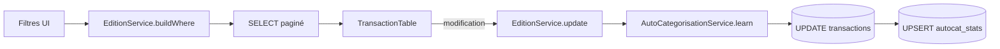

### Historique annuler / refaire

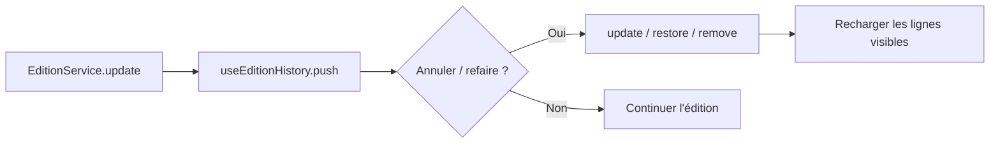

### Préférences du tableau

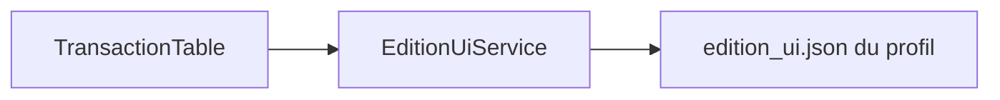

| Action utilisateur | Service | SQL |
|--------------------|---------|-----|
| Lister / filtrer | `EditionService.list()` | `SELECT … WHERE … ORDER BY … LIMIT/OFFSET` |
| Modifier une ligne | `EditionService.update()` | `UPDATE transactions SET … WHERE id = ?` |
| Apprendre catégorie | `AutoCategorisationService.learn()` | `INSERT OR REPLACE autocat_stats` |
| Suggérer catégories | `AutoCategorisationService.suggest()` | Lecture `autocat_stats` en mémoire |
| Appliquer suggestions | `EditionService.applyCategories()` | Batch `UPDATE` |
| Insérer ligne | `EditionService.insert()` | `INSERT INTO transactions` |
| Supprimer | `EditionService.remove()` / `deleteIds()` | `DELETE FROM transactions` |
| Doublons | `EditionService.findDuplicates()` | `GROUP BY` date+montant+libellé+compte |

---

## 6. Processus d'agrégation (Dashboard & Finance)

Les deux pages consomment **`StatsService`** qui traduit les filtres UI en clauses SQL `WHERE`.

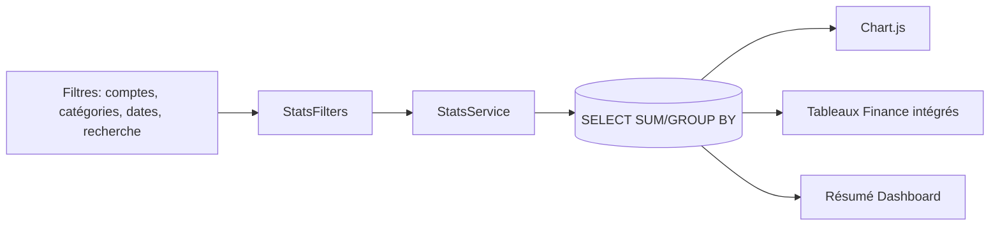

| Méthode StatsService | Usage | Type de requête |
|----------------------|-------|-----------------|
| `kpis()` | KPI Dashboard/Finance | `SUM`, `COUNT`, `MAX` |
| `categoryTotals()` | Barres dépenses par catégorie | `GROUP BY category_code` |
| `accountBalancesAt()` | Soldes à une date | Somme cumulée |
| `balancesOverPeriod()` | Courbe soldes | CTE / fenêtre temporelle |
| `categoryByPeriod()` | Barres mensuelles | `GROUP BY strftime(period)` |
| `bilanByPeriod()` | Onglet Bilan | Crédits/débits par catégorie |
| `listTransactions()` / `listAllTransactions()` | Export et rapprochements métier | `SELECT` paginé/complet |

**Granularité** : `autoGranularity()` choisit jour/semaine/mois/trimestre/année selon l'amplitude de la plage.

---

## 7. Processus prévisionnel

Les flux de grille, de calcul et de mutation sont séparés ; aucune liaison diagonale ne traverse
ainsi un autre parcours.

### Chargement de la grille

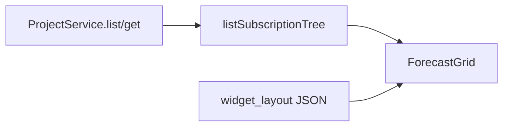

### Calcul des widgets

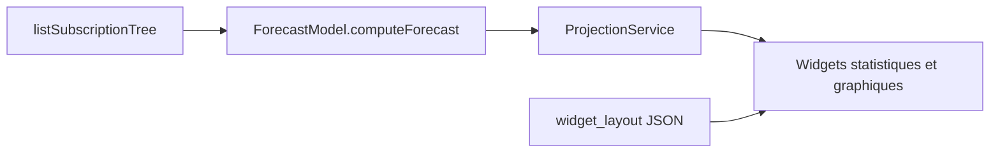

### Mutation de la grille

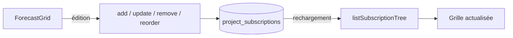

- La grille transforme l’arbre persisté en lignes éditables.
- Les groupes sont reliés par `parent_id` et ordonnés par `sort_order`.
- `ForecastModel` calcule les occurrences, les soldes et les ventilations en mémoire.
- La configuration des colonnes, widgets, granularité et split est persistée dans `widget_layout`.

## 8. Processus Contacts → Devis → Facture → Paiement

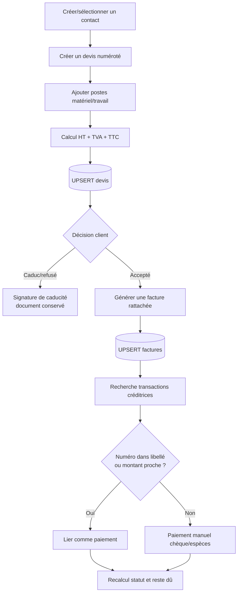

`InvoiceService` assure les numéros uniques au niveau applicatif et sérialise les dates.
`PaymentTrackingService` classe les correspondances par libellé, montant ou les deux.

## 9. Processus Dons (ex-page Association redistribuée)

Config identité : Paramètres → Organisation. Donateur : Contacts. Journal / émission : `#/dons`.
États figés : Registre.

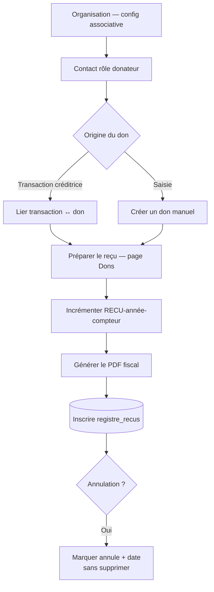

---

## 10. Processus de migration Comptal2

```mermaid
flowchart LR
    DIR[Dossier profil Comptal2] --> A[MigrationService.analyze]
    A --> UI[DataTab — aperçu]
    UI --> M[MigrationService.migrate]
    M --> SQL[(INSERT accounts, categories, transactions)]
```

| Source Comptal2 | Destination Comptal2.1 |
|-----------------|------------------------|
| `parametre/*.json` | Tables `accounts`, `categories` |
| `data/*.csv` | Table `transactions` + `imports` |
| Clé fragile `Source\|rowIndex\|…` | PK `id` auto-incrémentée |

Lecture via `read_external_*` (chemin absolu choisi par dialog).

---

## 11. Processus d'export

| Export | Service | Destination |
|--------|---------|-------------|
| Transactions CSV (Dashboard) | `ExportService.exportTransactionsCsv()` | Fichier externe via dialog `save` |
| Profil ZIP | `ProfileService.exportZip()` | `zip_dir` → chemin absolu |

---

## 12. Journalisation (logs JSONL)

Tout appel métier important passe par `withLog()` :

| Type fichier | Contenu |
|--------------|---------|
| `*_app.jsonl` | Événements applicatifs |
| `*_error.jsonl` | Erreurs |
| `*_data.jsonl` | Requêtes SQL, opérations données |
| `*_perf.jsonl` | Durées > 100 ms |

Écriture via `tauriBridge.appendTextLine()` → commande Rust `append_text_line`.

---

## 13. Résumé des flux par page

| Page | Lecture | Écriture |
|------|---------|----------|
| Dashboard | `StatsService`, `ConfigService` | `ExportService` (CSV externe) |
| Upload | `FileDetectionService`, `ConfigService`, `ImportTemplateService` | `ImportService` → SQL |
| Édition | `EditionService`, `ConfigService`, `AutoCategorisationService` | `EditionService` → SQL |
| Finance | `StatsService`, `ProjectService`, `ProjectionService` | `ProjectService` (projets) |
| Prévisionnel | `ProjectService`, `ForecastModel`, `ProjectionService` | Prévisions, lignes et layout |
| Contacts | `ClientService`, `ContactGroupService`, `InvoiceService` | Contacts et groupements |
| Facturation | Services contacts, émetteur, postes, documents et transactions | Devis, factures, paiements, pièces jointes |
| Dons | `DonationService`, reçus, config associative | Dons, liens, reçus ; config via Organisation |
| Paramètres | Tous services config | `SettingsService`, `ProfileService`, `ConfigService`, `MigrationService`, `Db` |

---

## 14. Fichiers clés du code

| Fichier | Rôle dans le flux |
|---------|-------------------|
| `src/main.tsx` | Orchestration boot |
| `src/services/db.ts` | Schéma, migrations, accès SQLite |
| `src/services/ProfileService.ts` | Cycle de vie profil + DB |
| `src/services/ImportService.ts` | INSERT import |
| `src/services/EditionService.ts` | CRUD transactions |
| `src/services/StatsService.ts` | Agrégats lecture seule |
| `src/services/ProjectService.ts` | Prévisions et arbre de lignes |
| `src/services/ForecastModel.ts` | Calcul des widgets prévisionnels |
| `src/services/ClientService.ts` | Contacts |
| `src/services/InvoiceService.ts` | Documents de facturation |
| `src/services/PaymentTrackingService.ts` | Rapprochement des paiements |
| `src/services/DonateurService.ts` | Donateurs et liens bancaires |
| `src/services/tauri.ts` | Pont FS / session |
| `src-tauri/src/paths.rs` | Résolution chemins data |
