# Carte — Contacts

## Dépendances

Chaque ligne décrit un parcours autonome depuis la page Contacts jusqu'à son stockage ou son
service externe.

```mermaid
flowchart TB
    subgraph fiche [Consulter ou modifier une fiche]
        direction LR
        PAGE1[Client.tsx · ClientTree] --> FICHE[ContactFicheModal]
        FICHE --> CLIENT[ClientService]
        CLIENT --> CT[(clients)]
    end

    subgraph recherche [Rechercher une entreprise]
        direction LR
        PAGE2[ContactFicheModal] --> SIRENE[SireneAPIService]
        SIRENE --> FORM[Préremplissage de la fiche]
    end

    subgraph groupes [Gérer les groupements]
        direction LR
        PAGE3[ClientTree] --> GROUP[ContactGroupService]
        GROUP --> CG[(contact_groups)]
    end

    subgraph documents [Afficher les documents liés]
        direction LR
        PAGE4[ContactElementModal] --> INVOICE[InvoiceService]
        INVOICE --> DOCS[(devis / factures)]
    end
```



## Opérations

| Action | Fonction | Résultat |
|---|---|---|
| Charger | `ClientService.loadClients` | Réhydratation des dates/adresses |
| Chercher | `ClientService.searchClients` | Filtrage normalisé sans accents |
| Enregistrer | `ClientService.upsertClient` | Code généré + UPSERT du payload |
| Grouper | `ContactGroupService` | CRUD du groupement |
| Ouvrir un encart | `ContactElementModal` | Documents associés au `clientId` |

## Arborescence

```
Client.tsx
└── ClientTree
    ├── reload → ClientService.loadClients, InvoiceService.loadDevis/loadFactures, ContactGroupService.loadGroupes
    ├── saveClient → ClientService.upsertClient
    ├── createGroupe / deleteGroupe → ContactGroupService
    ├── DonationService.listByContact
    ├── ContactFicheModal / ClientForm / EntrepriseSearch
    ├── ContactElementModal
    └── DevisModal / FactureModal / PaiementFactureModal / CaducDevisModal / DonationFormModal
```
