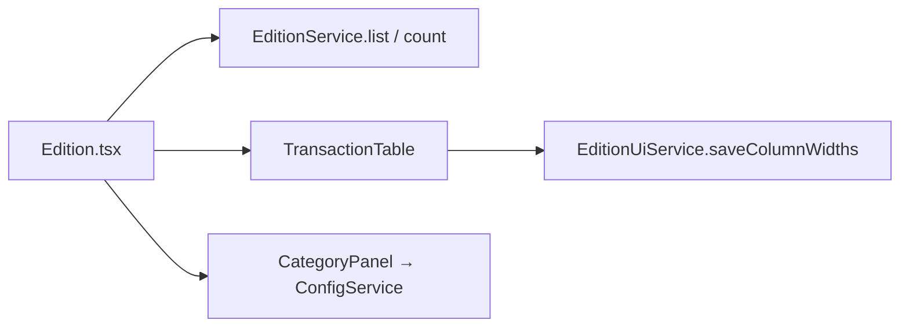
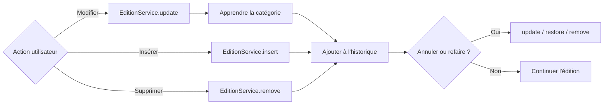

# Carte — Page Édition

> Référence rapide : fonctions, services et composants propres à la page Édition.

---

## Identité

| Champ | Valeur |
|-------|--------|
| Route | `/edition` |
| Fichier page | `src/pages/Edition/Edition.tsx` |
| Constante | `PAGE_SIZE = 500` |
| Debounce recherche | 300 ms |

---

## Services utilisés

### ConfigService
| Méthode | Usage |
|---------|-------|
| `listAccounts()` | Référentiel comptes |
| `listCategories()` | Référentiel catégories |

### EditionService
| Méthode | Usage |
|---------|-------|
| `list(filters)` | Lignes paginées avec tri SQL |
| `count(filters)` | Total lignes filtrées |
| `update(id, fields)` | Modification champ(s) |
| `insert(row)` | Nouvelle transaction |
| `remove(id)` | Suppression unitaire |
| `applyCategories(updates)` | Application batch catégories |
| `findDuplicates()` | Groupes de doublons |
| `deleteIds(ids)` | Suppression multiple |
| `listUncategorized(filters)` | Lignes sans catégorie (auto-cat) |

### AutoCategorisationService
| Méthode | Usage |
|---------|-------|
| `loadStats()` | Charge table `autocat_stats` en mémoire |
| `suggest(label, stats)` | Propose catégorie pour un libellé |
| `learn(label, category)` | Met à jour stats après édition |

### Historique et préférences
| Module | Usage |
|---|---|
| `useEditionHistory` | Pile undo/redo, raccourcis et actions groupées |
| `EditionUiService` | Charge/sauvegarde les largeurs par profil |
| `ConfigService` | CRUD du panneau Catégories |
| `LabelRuleService` | Libellés routiniers (`apply`, `upsert`) |

### Logger
| Méthode | Usage |
|---------|-------|
| `Logger.error(...)` | Erreurs opérations |

---

## Types importés

| Type | Source | Rôle |
|------|--------|------|
| `Account`, `Category`, `TransactionRow` | `types/models.ts` | Modèles |
| `DuplicateGroup` | `EditionService` | Groupe doublons |
| `SuggestionItem` | `AutoCatReviewModal` | Suggestion auto-cat |
| `SortCol` | local | Colonnes triables |

---

## Composants enfants

| Composant | Rôle |
|-----------|------|
| `EditionToolbar` | Actions (auto-cat, doublons, ajout) + filtres |
| `FilterPanels` | Onglets filtres compte/catégorie/période/recherche |
| `TransactionTable` | Table éditable, virtualisée, redimensionnable, menu contextuel |
| `CategoryPanel` | CRUD catégories à droite |
| `AutoCatReviewModal` | Revue suggestions |
| `DuplicatesModal` | Liste et suppression doublons |
| `RoutineLabelModal` | Création / édition d’un libellé routinier |
| `ConfirmModal` | Confirmation suppression |

---

## Filtres (`EditionFilters`)

Construits par `baseFilters()` et `filters()` :

| Champ | Source état | SQL |
|-------|-------------|-----|
| `accountIds` | `selectedAccounts` | `IN (...)` si sous-ensemble |
| `categoryCodes` | `selectedCategories` | `IN (...)` si sous-ensemble |
| `uncategorizedOnly` | `uncategorizedOnly` | `IS NULL OR ''` |
| `dateStart` / `dateEnd` | dates | `BETWEEN` |
| `search` | `searchDebounced` | `LIKE` |
| `sortBy` / `sortDir` | tri | `ORDER BY` |

---

## Fonctions internes de la page

| Fonction | Rôle |
|----------|------|
| `baseFilters()` | Filtres sans uncategorizedOnly ni tri |
| `filters()` | Filtres complets pour list/count |
| `reloadMeta()` | Charge comptes + catégories |
| `reloadRows()` | list + count + count global |
| `handleUpdate(id, fields, prev)` | Update + learn si catégorie |
| `runAutoCat()` | Lance suggestions auto-cat |
| `applySuggestions(items)` | Applique catégories validées |
| `handleInsert()` | Insère ligne vide |
| `handleSort(col)` | Bascule tri |
| `history.undo()` / `history.redo()` | Rejoue les mutations persistées |

---

## Tables SQLite lues/écrites

| Table | Opérations |
|-------|------------|
| `transactions` | SELECT, UPDATE, INSERT, DELETE |
| `autocat_stats` | SELECT, UPSERT (via learn) |
| `accounts` | SELECT (jointure affichage) |
| `categories` | SELECT (jointure affichage) |

---

## Schéma d'appel édition

### Chargement et composants de page

### Mutation et historique

---

## Fichiers CSS associés

- `src/styles/edition-custom.css`
